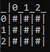
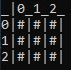
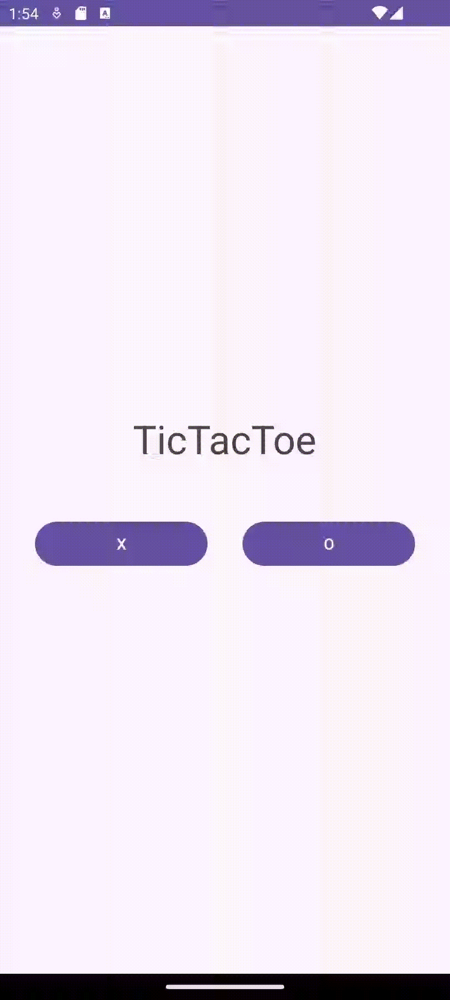

Monte Carlo Tree Search Tic Tac Toe
 
C++ Version Breakdown 
Mcts.* are the files used to implement mcts. bot has a utilizes a think method which implements each step of mcts which are to traverse, expand, rollout, and backpropogate. 
The the board class is a container for my version of a tic tac toe game. The class facilitates the game between the playe rand the ai, and interfaces with the board_state class.
The board_state class is the tic tac toe game itself. It contains the board, a way to set spaces in the board, and is able to check if the game is finished. 
The current c++ folder implements a tic tac toe game in command prompt. The program runs an mcts bot to play the game against the player. The mcts bot is basic and prioritizes winning over defending. This program is personal review for implementing mcts. 
The following images show how the bot prioritizes getting an available win, as well as failing to block a future loss. In both examples the bot is 'X'. 

 
Java Version Breakdown 
The java version is almost an exact copy of the c++ version. Some class structures were changed to accomodate for java syntax.
the program still runs a random rollout strategy where the bot does not always block a guaranteed loss. I used the java code to create an app in android app studio that would better visually respresent a tic tac toe game.
The androidapp studio files that were modified are included in the repo but the app studio project itself is not in this repo. 
 